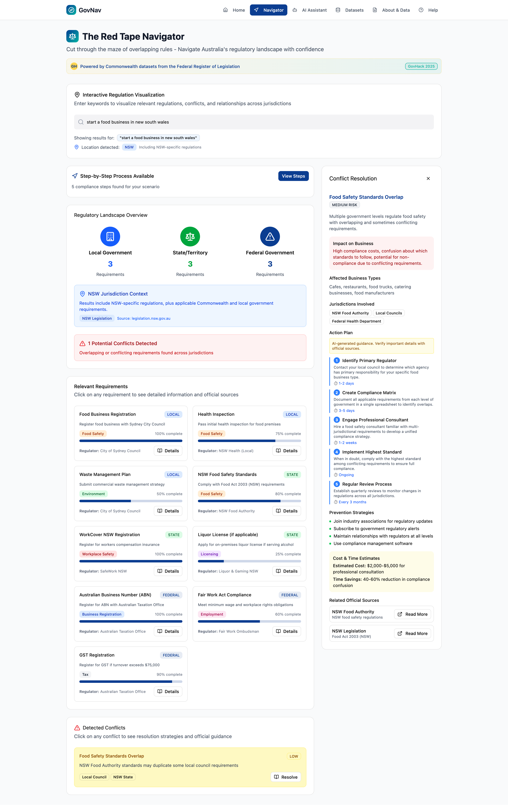

# Red Tape Navigator

*Cut through the maze of overlapping rules — navigate Australia's regulatory landscape with confidence.*

_A prototype showing regulatory conflict resolution._

## The Problem
Australia's regulatory landscape spans local, state, and federal levels, making it difficult for businesses and individuals to know which laws apply — and where they conflict or overlap. This creates the need for a simplified way to resolve regulatory inconsistencies.

## The Solution

*Red Tape Navigator* is the first AI-driven regulatory assistant that provides a clear, step-by-step approach for setting up a business while meeting requirements across federal, state, and local jurisdictions.

*   *Simple Chat Interface*: Users can input their queries into a chatbox and receive tailored guidance.
*   *AI-Driven Action Plan*: The AI summarises local, state, and federal regulations to provide a step-by-step action plan.
*   *Conflict Resolution with AI*: The AI generates simplified action plans to resolve conflicting regulations.
*   *Transparent & Reliable*: Each regulatory information and conflict resolution plan includes citations for validation to consistent with the AI Technical Standards design [https://www.digital.gov.au/policy/ai/AI-technical-standard/technical-standard-governments-use-artificial-intelligence-design](https://www.digital.gov.au/policy/ai/AI-technical-standard/technical-standard-governments-use-artificial-intelligence-design).

## How We Built It

We designed a user-centric solution using a modern tech stack focused on transparency and reliability:

1.  *Figma:* Used for prototyping the user interface and experience, with emphasis on simplicity, accessibility, and responsiveness.
2.  *Specialised AI for Legislations:* AAI trained exclusively on local, state, and federal legislation.
3.  *Periodic Updates:* Regularly ingests new data to ensure users always access the latest regulations.

## Challenges We Ran Into

*   *Designing for Digital Inclusion:* Creating an interface intuitive for both tech-savvy and digitally excluded users was a major design challenge. We addressed this through rigorous testing of the chat interface.
*   *AI Technical Standards Design:* Ensuring transparency and reliability of the AI-generated action plans required prompting the AI to fetch real-time data from government databases, with source details included.
*   *Testing the Action Plan:* Validation required rigorous cross-checking of AI-generated action plans against regulatory databases.

## Data Sources

*   *Commonwealth Statute Book*: [https://www.alrc.gov.au/datahub/the-commonwealth-statute-book/](https://www.alrc.gov.au/datahub/the-commonwealth-statute-book/).
*   *Federal Register of Legislation*: [https://www.legislation.gov.au/](https://www.legislation.gov.au/).
*   *NSW Register of Legislation*: [https://legislation.nsw.gov.au/](https://legislation.nsw.gov.au/)
*   *SA Register of Legislation*: [https://www.legislation.sa.gov.au/](https://www.legislation.sa.gov.au/)

## What's Next for Red Tape Navigator

We believe this is just the beginning. Our next steps are:

1.  *Expand to All States:* Include regulations from every state and territory across Australia.
2.  *Enhance Conversations:* Improve the chat experience by enabling multi-turn conversations for clarifications.
3. *Enable Guardrails:* Add safeguards to prevent AI hallucinations.
4. *Deploy:* Launch the application for real-world use.

## Try Our Prototype

Experience a simulation of how the Red Tape Navigator works:
*[https://creme-savor-87554130.figma.site/](https://creme-savor-87554130.figma.site/)*

---

*Built for GovHack 2025 by Team SPYDER*